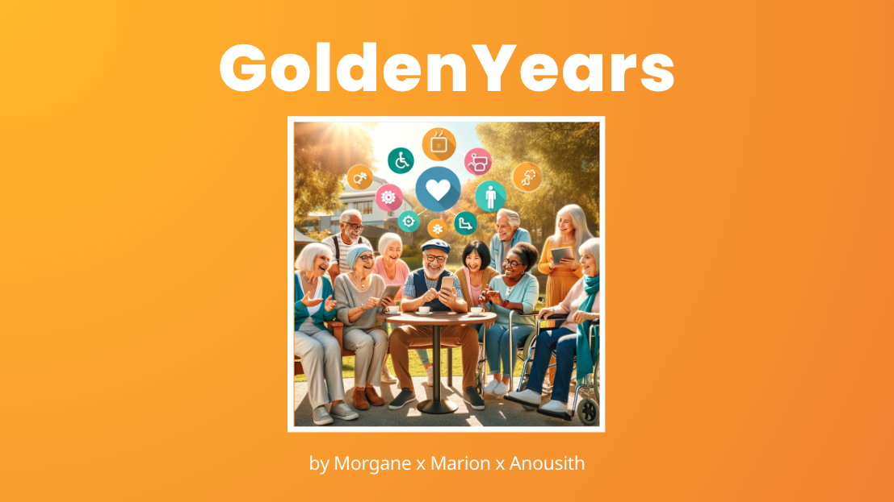
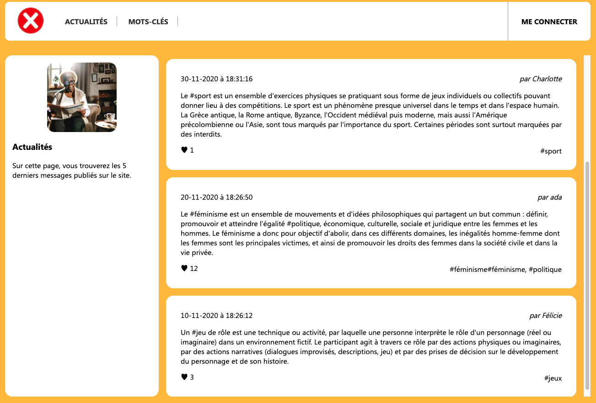
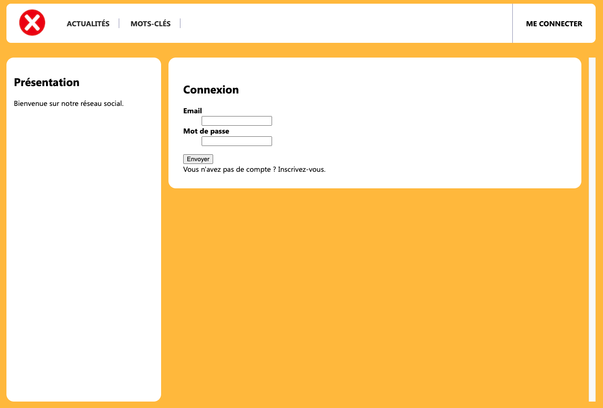
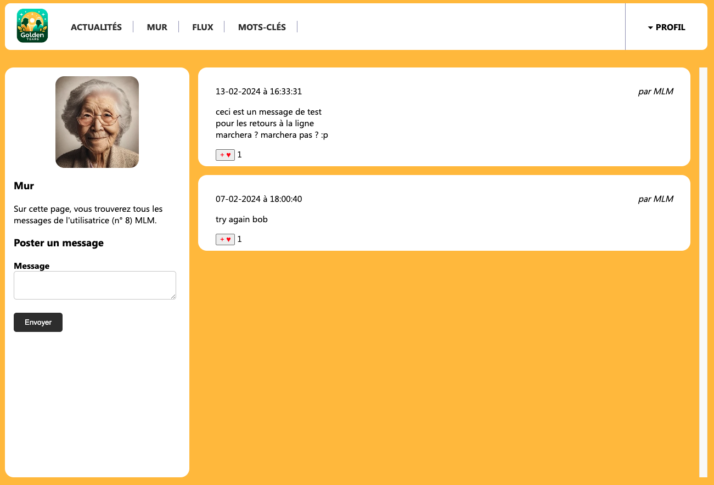
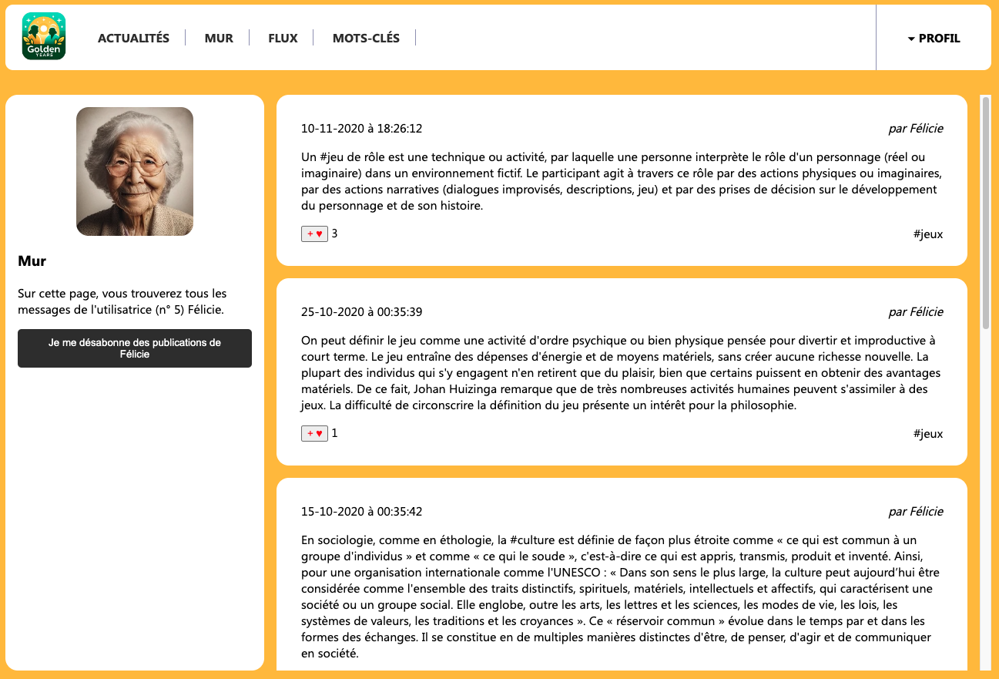
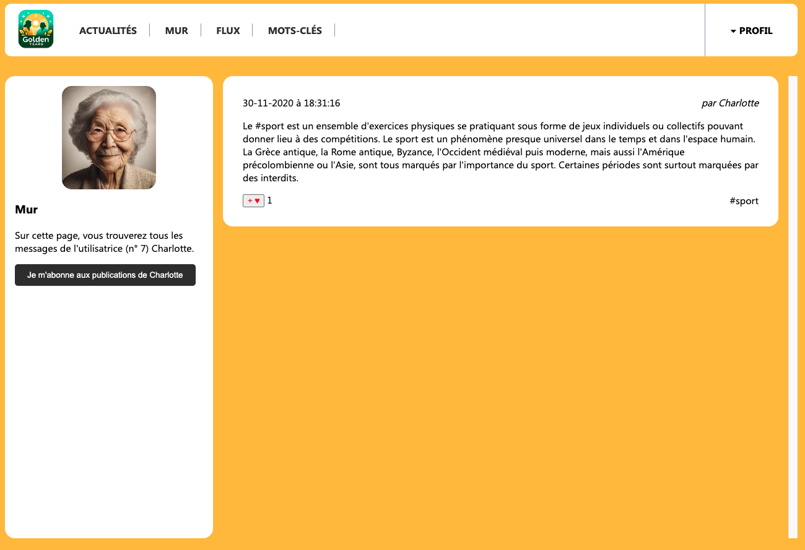
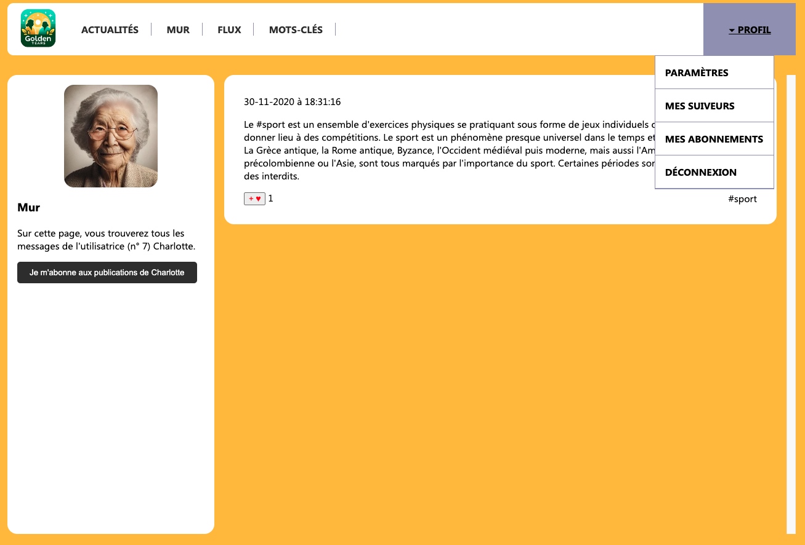
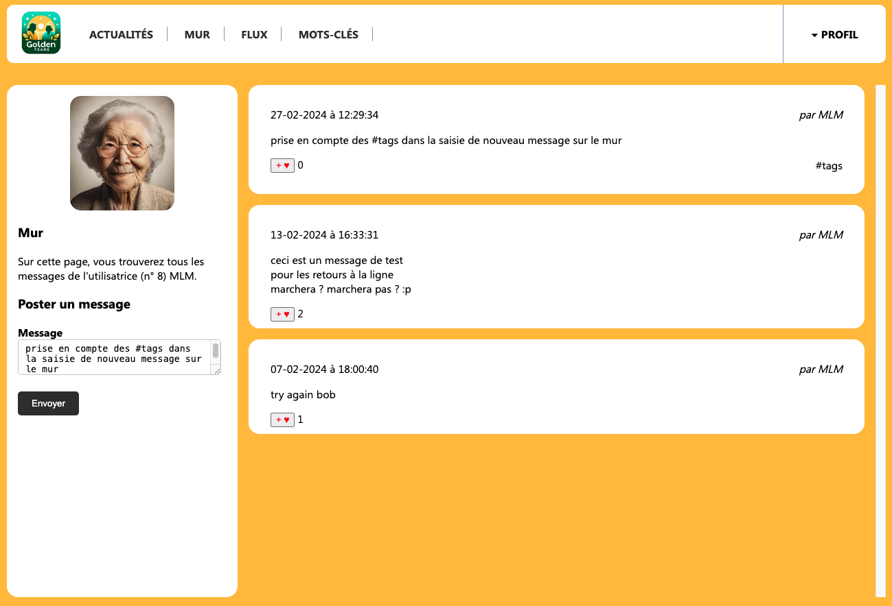

# GoldenYears (student exercise)

A Tailored Social Network for Nursing Home Residents !

This project involved refactoring the existing codebase of a social network platform built in PHP with the following objectives:

- Debugging and fixing existing code issues
- Enhancing the overall architecture for better scalability and maintainability
- Completing unfinished features and adding missing functionalities

## Deployment

(local only)

Repo GitHub : [https://github.com/adatechschool/reseau-social-php-morgane-anousith-marion]()

## Features 

### Skills Demonstrated in the Project

- Understanding client-server interactions and the minimal configuration of an Apache/PHP/MySql server (MAMP)
- Generating HTML code using a programming language (PHP)
- Utilizing GET parameters for data transmission
- Processing HTML forms in PHP 
- Managing the registration/authentication process 
- Database queries and interactions (mariadb/mysql)
- Styling HTML with CSS

### Features added

* User registration
* User session LOGIN/LOGOUT
* Header displayed depending on the active session
* Page access depends of session LOGIN/LOGOUT
* Author linked to author wall
* Post on user wall only
* Follow button on wall not followed 
* Unfollow button on wall already followed
* Login link on registration page
* "#tag" linked to tag page
* Display paragraphs

### Features ++

* Code structuration (require/include)
* tags check/created when creating a post (atomic execution)
* Like on post only if logged

## Built With

* [MAMP](https://www.mamp.info/en/mac/) - Local web development solution
* [PHP 8](https://www.php.net/) - Scripting language
* [mySQL](https://www.mysql.com/) - Relational database management system (RDBMS)
* [phpMyAdmin](https://www.phpmyadmin.net/) - mySQL administration tool
* [Visual Studio Code](https://code.visualstudio.com/) - IDE

## Collaboration

### Method

In the initial phase of exploring the provided codebase, we worked independently to gain a thorough understanding of the code and the mandated technology stack. 

Once we were comfortable with the code and the technologies involved, we distributed the tasks among ourselves.

For tackling complex problems, especially those related to authentication challenges, we employed mob programming. 

This approach allowed us to collaboratively navigate through intricate issues by harnessing the collective expertise and perspectives of the entire team.

### Tools

We utilized the following collaboration tools:

- Notion (Kanban)
- VSC LiveShare (VSC extension)
- Git, GitHub

## Screenshots
### Logged out

2 menu entries / 1 login button / no access to "like"

### Login page

### User's wall (when logged in)

4 menu entries / Profil menu available / Ability to post a message / Access to "like" button

### Followed user's wall

Unfollow button / "like" button

### Not followed user's wall

Follow button / "like" button

### Profil menu

Access to : settings / folowers list  / following list / log out button

### Adding #tags to post

If tag do not already exist, it is created in "tags" table + post is added to "posts" table + post x tag is added to "posts_tags" table (atomic execution)

## Authors

* **Morgane Le Moal** - [GitHub](https://github.com/M0nline)
* **Marion Ochem** - [GitHub](https://github.com/MarionOchem)

## Dates

* Exercise duration : 6 days
* Exercise demo : 15 february 2024